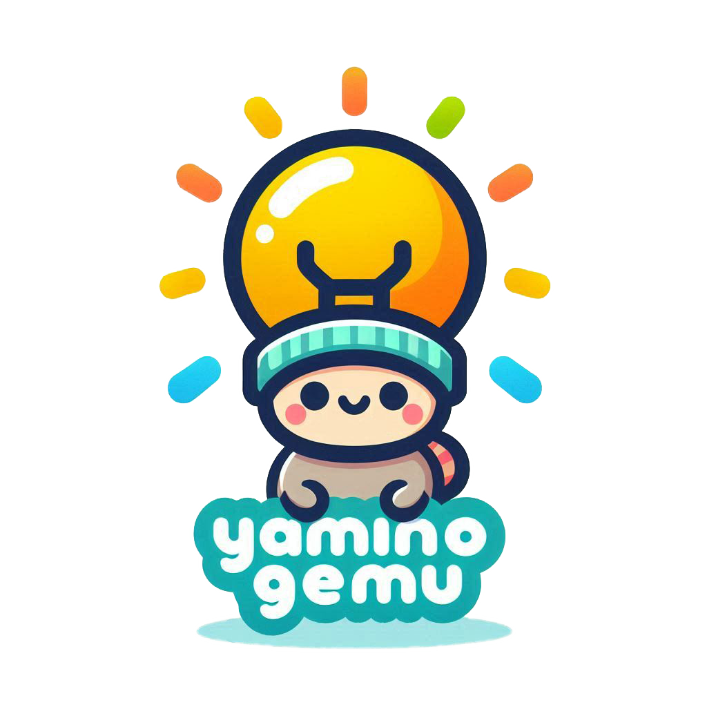
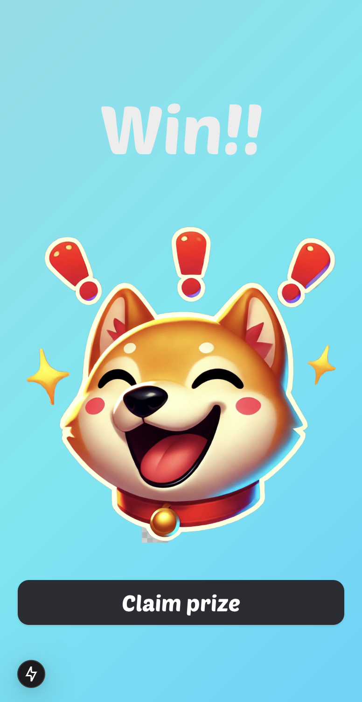

<h1>Yaminogemu</h1>

</img>

### Our contracts address and Demo link
- Solana contract address:[2YacFff9ohCN71SJQCFbhrKUKXx1BhoHTFYWFWYqieZd](https://explorer.solana.com/address/2YacFff9ohCN71SJQCFbhrKUKXx1BhoHTFYWFWYqieZd?cluster=devnet)
- Solana contract source code:[https://github.com/hollow-leaf/Yaminogemu/tree/main/contracts](https://github.com/hollow-leaf/Yaminogemu/tree/main/contracts)
- Front-end connection contract methods:[https://github.com/hollow-leaf/Yaminogemu/blob/main/frontend/src/hooks/solanahook.tsx](https://github.com/hollow-leaf/Yaminogemu/blob/main/frontend/src/hooks/solanahook.tsx)
- Demo video:

# Description

Yaminogemu is a protocol that settles in BONK and provides liquidity, primarily consisting of two major functions: GameFi and DeFi.

Yaminogemu GameFi: In knowledge competitions, players can use various meme tokens as entry fees, where losers' entry fees are automatically swap to BONK and distributed to winners.

Yaminogemu DeFi: Users can stake BONK to earn yields from the meme token liquidity pool.

# Technical Use

- Solana smart contract ([https://github.com/hollow-leaf/Yaminogemu/tree/main/contracts](https://github.com/hollow-leaf/Yaminogemu/tree/main/contracts/zkprograms/yaminogemu))
- ZK proof powered by Bonsol (https://github.com/hollow-leaf/Yaminogemu/tree/main/contracts/zkprograms/yaminogemu)
- Serverless architecture powered by Cloudflare Worker and D1 Database(https://github.com/hollow-leaf/Yaminogemu/tree/main/serverless)
- Nextjs and PWA (https://github.com/hollow-leaf/Yaminogemu/tree/main/frontend)

# Yaminogemu GameFi

### Step 1: Pay listed memecoins to participate in the battle

    

        
To join the game, players must stake their meme tokens as an entry fee.

        
Players deposit tokens into the Yaminogemu staking pool using a connected Solana wallet. The amount of the bet determines their eligibility for the battle.

        
Staked tokens create a high-stakes environment, adding to the excitement of competition as players risk their meme assets for a chance to win big.

    

    

        </img>
    

### Step 2: Finding a Match

    

        
Once tokens are staked, the system initiates a matchmaking process to pair players of similar skill levels and token stakes.

        
The backend system scans the pool of available players to find a suitable match based on their token amount and battle history.
        If no immediate match is found, the player enters a waiting queue and is notified when an opponent is ready.

        
The matchmaking system ensures fair and balanced competition, making each battle both challenging and engaging.

    

    

        </img>
    

### Step3: Battle!

    

        
Players face off in a knowledge-based quiz about blockchain and cryptocurrency. The game tests their understanding of the decentralized world in a series of fast-paced questions.

        
Questions cover topics like blockchain fundamentals, DeFi, NFTs, smart contracts, and more.
        Players compete to answer questions correctly within a time limit.
        Each correct answer earns points, and the player with the highest score at the end of the quiz wins.

        
The battle combines intellectual challenge with high-stakes gameplay, turning blockchain learning into a fun and rewarding experience.

    

    

        </img>
    

### Step 4: Win and earn BONK from opponent

    

        
The winner of the battle claims all staked tokens from the opponent, which are automatically swapped for BONK tokens.

        
The smart contract calculates the total stake and distributes rewards to the winner.
        Rewards are transferred to the winner’s connected wallet as BONK tokens, ready to be used, swapped, or staked again.

        
Winning doesn’t just mean glory; it means real rewards in the form of BONK tokens. The more you win, the more you earn, creating a true play-to-earn experience.

    

    

        </img>
    

# Yaminogemu DeFi (Memecoin ETF)

## Memecoin-to-BONK Exchange Ratios

    

        
The Memecoin-to-BONK exchange functionality ensures a seamless and equitable trading experience. By providing a transparent and dynamic exchange rate mechanism, users can easily convert their meme tokens into BONK, the core token of Yaminogemu.

        
The smart contract determines exchange rates based on current liquidity, demand, and market value of meme tokens in the pool.
        Users can view the live exchange rates before initiating a swap, ensuring clarity and trust.
        Swapped BONK tokens are sent directly to the user’s wallet for immediate use.

        
This feature ensures that users can convert their BONK holdings into Meme tokens without reliance on external exchanges, making it quick and easy to participate in Yaminogemu’s ecosystem.

    

    

        </img>
    

## Staking BONK and earn revenue from memecoin pool

    

        
By staking BONK tokens, users unlock the ability to earn passive income from transaction fees and liquidity incentives generated within the Memecoin ETF and swap pools.

        
Users stake their BONK tokens in the Yaminogemu staking pool.
        Revenue from swaps, trades, and liquidity fees within the Memecoin ETF is distributed proportionally to BONK stakers.
        Staked BONK tokens also qualify users for exclusive perks, such as reduced trading fees and priority access to new game features.

        
Staking BONK not only strengthens the Yaminogemu ecosystem but also provides users with a sustainable way to grow their wealth. It’s a win-win for both active players and long-term holders.

    

    

        </img>
    

### Team members
- Software Architect(Full Stack): [Solo Lin](https://github.com/LinXJ1204)
- Frontend engineer: [Jake Kuo](https://github.com/crypto0627)
- Blockchain engineer: [Albert Cheng](https://github.com/cheng-chun-yuan)
